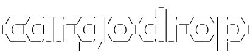
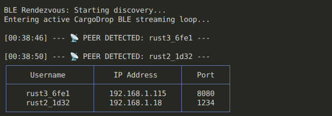
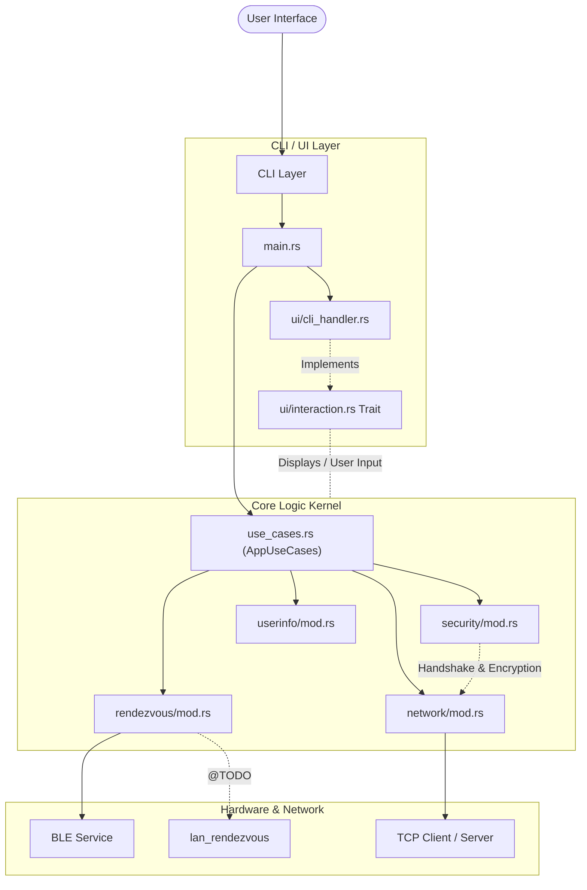

# CargoDrop : P2P File Transfer in Rust



CargoDrop is a decentralized, peer-to-peer file transfer tool inspired by Apple's AirDrop. It allows you to discover nearby devices and securely send files over your local network using a combination of **Bluetooth Low Energy (BLE)** for discovery and **TCP** for high-speed data transfer.

### Key Features
- **Hybrid Protocol**: Bluetooth Low Energy (BLE) based rendezvous (discovery + advertising), with TCP-based file streaming.
- **Secure by Default**: Built-in identity verification and encrypted handshakes.
- **Interactive CLI**: Real-time progress bars and terminal-based peer selection.
- **Highly Decoupled**: Shared "Kernel" logic ready for both CLI and Future GUI integrations.

> [!Important]
> **Why is a common WiFi connection required ?**
> In other consumer grade implementations (like Airdrop, QuickShare...), what happens in the background is the creation of an ad-hoc under the hood wifi connection between peers at the transfer time (*Wifi-Direct*).
> Creating such connections is an immense undertaking, as there is no open-source stable solution to this. Wi-Fi Direct APIs are handled very differently across Linux, Windows, and macOS and there is no common, reliable abstraction layer that works seamlessly everywhere.


## Installation & Dependencies

### Prerequisites

**Rust**: Ensure you have the latest stable version installed via [rustup.rs](https://rustup.rs/).


> [!Note]
> **MacOS/Windows**: This project has **been developed and tested** on Linux. While the libraries used are cross-platform, other OS users may encounter Bluetooth-related issues (especially on Mac, because of bluetooth authorizations). If you do, please [file an issue on GitHub](https://github.com/Qconed/cargodrop/issues).

### Dependencies
```bash
# On Ubuntu/Debian
sudo apt install libdbus-1-dev pkg-config
```

### Build
```bash
git clone https://github.com/Qconed/cargodrop.git
cd cargodrop
cargo build --release
```

---

## Usage

### 1. The "AirDrop" Workflow

**On the Receiver side:**
Start in "Reception" mode to be discoverable and wait for incoming files.
```bash
cargo run -- receive
```

**On the Sender side:**
Search for nearby devices and pick one from the interactive list.
```bash
cargo run -- send --file ./my_important_doc.pdf
```
*Wait ~15-20 seconds for discovery to populate the list, then select your target.*


### 2. Direct Transfer (Manual IP)
If you already know the receiver's IP:
```bash
# Receiver
cargo run -- receive --port 5001

# Sender
cargo run -- send --ip 192.168.1.10 --port 5001 --file path/to/file
```

*Fig: Example of the discovery output:*



### 3. Utility Commands
- `cargo run -- info`: View your local IP, username, and configured port.
- `cargo run -- set-name <NEW_NAME>`: Change how you appear to others. (`--default` value is the hostname)
- `cargo run -- set-port <PORT>`: Change the TCP listening port. (`--default` value is 8080)


```bash
$ cargo run help
A command line interface for CargoDrop

Usage: cargodrop <COMMAND>

Commands:
  advertise  Start CargoDrop in Advertiser Mode
  discover   Start CargoDrop in Discovery Mode
  send       Send a file
  receive    Receive a file
  getip      Get local IP address
  getname    Get current username
  setname    Set username (max 14 characters)
  getport    Get configured TCP transfer port
  setport    Set TCP transfer port
  info       Display all user configuration info
  help       Print this message or the help of the given subcommand(s)

Options:
  -h, --help  Print help
```

> [!Note]
> All commands usage and flags are detailed using the `--help` flag on them.

---

## Architecture

CargoDrop follows a clean, decoupled architecture using **Traits** for dependency inversion. This ensures the core transfer logic is agnostic of the UI layer.

### Component Diagram



### Module Breakdown
| Module | Responsibility |
| :--- | :--- |
| **`main.rs`** | Composition root. Wires up components and implements the `App` state. |
| **`use_cases.rs`** | Defines the high-level business capabilities (Send, Receive, Discover). |
| **`rendezvous/`** | Handles peer discovery & advertising. Currently prioritizes BLE (Bluetooth Low Energy). |
| **`network/`** | The "heavy lifting" layer. Handles raw TCP streams and JSON handshakes. |
| **`security/`** | Manages cryptographic keys, identity fingerprints, and session encryption. |
| **`ui/`** | Abstracts terminal interactions to allow future GUI swaps. |
| **`interaction.rs`** | Trait providing the functions to use when displaying info or asking input from the user: decoupling the core logic from the UI.|

---

## Future Areas for Improvement

### User Experience (GUI)
- **Egui**: Developing a cross-platform desktop application to provide a truly seamless AirDrop-like drag-and-drop experience.


### Transfer Speed
- **Optimized Buffering**: Implementing adaptive buffer sizes based on network conditions.
- **Parallel Chunking**: Transferring large files faster by avoid  limiting in parallel over multiple TCP streams for maximum throughput.

### Architecture Refinement
- **Library Extraction**: Separating the "Kernel" into a standalone module (`cargodrop-core`) that can be consumed by both CLI and GUI wrappers.
- **Configuration Persistence**: Replacing hardcoded defaults with a centralized `config.toml`.

