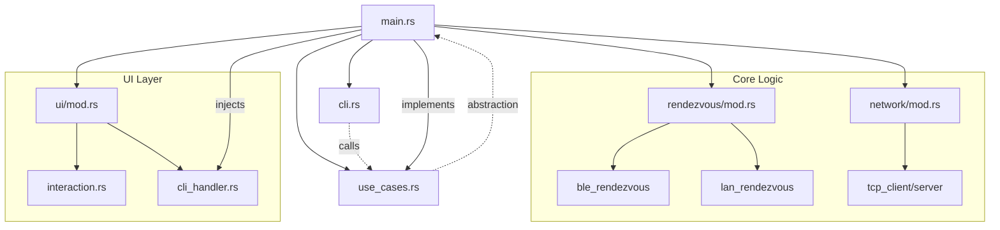
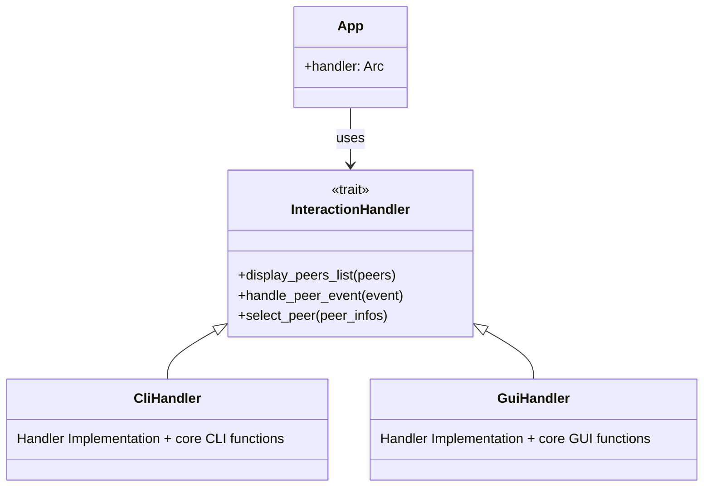
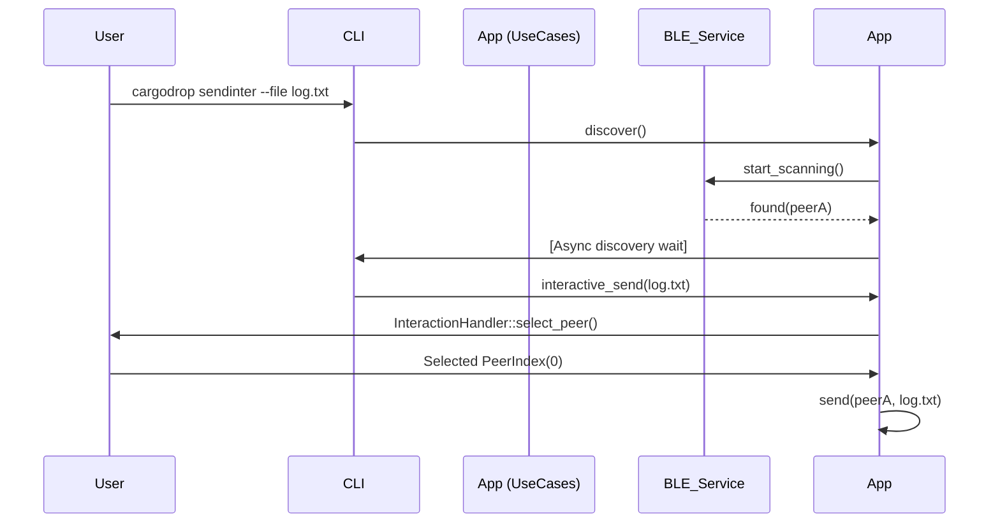
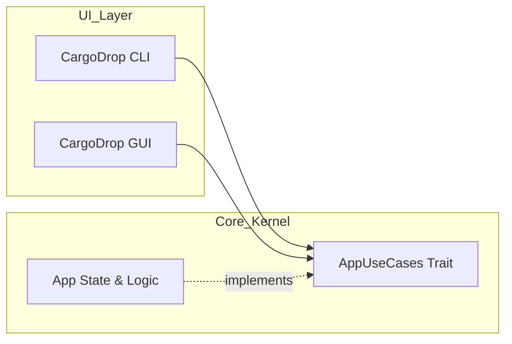

(To visualize this mardkown report with VSCode, install the [Markdown Preview Mermaid Support](https://open-vsx.org/vscode/item?itemName=bierner.markdown-mermaid) extension, and press `Ctrl+Shift+V` to visualize compiled report)

# CargoDrop Architecture Report

## TLDR: The "AirDrop for Rust"
CargoDrop is a decentralized, peer-to-peer file transfer tool. Its architecture prioritizes **decoupling** through Traits (Interfaces), allowing the core logic to remain agnostic of whether it's being run from a **CLI** (Current) or a **GUI** (Future). It uses **BLE/LAN Discovery** for rendezvous and **TCP** for reliable file streams.

---

## 🏗️ High-Level Module Architecture

The following diagram showcases the dependencies between major modules.

### Module Responsibilities
- **[main.rs](../src/main.rs)**: The "Composition Root". It manages the global state ([App](../src/main.rs#L22-L26)), implements the [AppUseCases](../src/use_cases.rs#L7-L21) trait, and wires up the UI handlers.
- **[cli.rs](../src/cli.rs)**: Pure command-line interface logic. It doesn't know *how* to send a file, only that it should call the `AppUseCases::send` method.
- **[use_cases.rs](../src/use_cases.rs)**: Defines the business capabilities of the app. If you want to add a feature (e.g., "History"), it starts here.
- **`ui/`**: Abstracts user interaction (printing messages, asking for input on the go).
- **`rendezvous/`**: Handles finding other peers on the network/air (BLE/LAN), as well as advertising one's presence.
- **`network/`**: The "Pipe". Handles bytes moving over TCP.

---

## 🎨 Specialized Design Patterns

### 1. The Interaction Handler Pattern
**Purpose:** Decouple the core domain functions from the user interface interactions.

- **Context:** When the discovery logic finds a peer, it doesn't `println!`. It calls `handler.handle_peer_event(NewPeer)`. 
- **Benefit:** We can swap the entire interface without touching the BLE discovery code. Because both GUI and CLI provide the same `handle` functions.

### 2. The UseCases Trait (Dependency Inversion)
**Purpose:** Enable CLI/GUI indifference.

- **Clap Integration:** [cli.rs](../src/cli.rs) uses `#[derive(Parser, Subcommand)]`. It maps CLI commands to [AppUseCases](../src/use_cases.rs#L7-L21) methods. Adding a command is just adding an enum variant in [cli.rs](../src/cli.rs) and a method in [use_cases.rs](../src/use_cases.rs).

> Note : Use cases are not CLI-only, they aim to be an abstratioin usable by both CLI and GUI.

---

## 📂 File Tree Exploration

| Path | Purpose | Key Contained Types/Functions |
| :--- | :--- | :--- |
| [src/main.rs](../src/main.rs) | Entry point & App State | `struct App`, `impl AppUseCases` |
| [src/use_cases.rs](../src/use_cases.rs) | Core business API | `trait AppUseCases` |
| [src/cli.rs](../src/cli.rs) | CLI Command mapping | `struct Cli`, `enum Commands` |
| [src/ui/interaction.rs](../src/ui/interaction.rs) | UI Abstraction | `trait InteractionHandler`, `enum PeerEvent` |
| [src/ui/cli_handler.rs](../src/ui/cli_handler.rs) | Terminal Handler Implementation | `struct CliHandler` |
| [src/rendezvous/mod.rs](../src/rendezvous/mod.rs) | Discovery Orchestration | [RendezvousManager](../src/rendezvous/mod.rs#L30-L31), `struct Peer` |
| `src/network/` | File transfer protocol | `TcpClient`, `TcpServer`, `FileTransfer` |

---

## 🛠️ How to Extend Properly

### 1. Adding a new command (e.g. `cargodrop info`)
1.  **Define UseCase**: Add `fn get_info(&self)` to `AppUseCases`.
2.  **Implement Logic**: In `main.rs`, implement `get_info` for `App`.
3.  **Map Command**: Add `Info` variant to `Commands` enum in `cli.rs`.
4.  **Connect**: In `cli.rs`, add the match arm to call `use_cases.get_info()`.

### 2. Best Practices
- **Never print in logic modules**: Use the `InteractionHandler` or return a `Result`.
- **Prefer Arc<RwLock<T>> for shared state**: Discovery and UI run on different threads; they need safe shared access to the peer list.
- **Keep UseCases small**: Orchestrate multiple complex services (Discovery + Network) in the use case implementation within `main.rs`, not inside the services themselves.

---

## ⚠️ Architectural Critique & Improvements

### 1. Coupling & "God" Objects
- **`main.rs` overgrowth**: `App` implementation of `AppUseCases` is becoming a "God" implementation. It handles formatting, logic orchestration, and state management. 
- **Fix:** Move `impl AppUseCases for App` into a `src/app_logic.rs` or similar.

### 2. Magic Numbers & Configuration
- **Hardcoded Constants**: Several "magic values" are scattered throughout the code:
    - **Port 5001**: Default port is hardcoded in `cli.rs`.
    - **Timeout (20s)**: The discovery timeout is hardcoded in `cli.rs`.
    - **Target Directory**: The `received/` folder is hardcoded in `tcp_server.rs`.
- **The Problem**: Changing a default behavior requires searching the entire codebase. It also makes testing harder as we can't easily inject a test configuration.
- **Fix**: Centralize these into a `src/config.rs` or use a `Settings` struct that is part of the `App` state.

### 3. Type Reuse & Convergence
- **The "Peer" Mapping Friction**: We currently have `rendezvous::Peer` and `network::PeerInfo` which are 90% identical but live in different modules.
- **The Problem**: Every time we move a peer from discovery to transfer, we have to perform manual mapping (found in `main.rs` and `cli_handler.rs`). This is error-prone and adds boilerplate.
- **Fix**: Define a "Canonical Peer" type in a shared `src/types.rs` or move `PeerInfo` to the core level. Any specific module needs (like BLE metadata) can be handled by wrapping or extending this core type.

### 4. Logic Redundancy (DRY)
- **IP Formatting**: Hand-rolled `format!("{}.{}.{}.{}", ...)` exists in at least two places.
- **Fix**: Implement `Display` for the core `Peer` type.

### 5. Proposed Refactoring for GUI/CLI
A common question arises: **"Should we have separate AppUseCases implementations for CLI and GUI?"**

- **The Bad Way**: Creating `CliApp` and `GuiApp` each implementing `AppUseCases`. This leads to duplicated business logic (transfer logic, discovery orchestration) being written twice.
- **The Good Way**: 
    1. **Extract Core**: Move the `App` struct and its `AppUseCases` implementation from `main.rs` to a dedicated `src/app.rs`. This becomes the "Kernel" of the application.
    2. **One Kernel, Multiple Triggers**: Both `main_cli.rs` and `main_gui.rs` initialize the *same* `App`. 
    3. **Lifecycle Handling**: Use the `InteractionHandler` to bridge the gap. For example, if the GUI needs a continuous discovery stream, the `App` can provide it, and the `GuiHandler` updates the state accordingly.
    4. **Shared State**: The `PeerMap` should remain the single source of truth, regardless of the UI.

#### Future Architecture Diagram

This architecture ensures that the "Brain" of CargoDrop remains 100% shared, while the "Body" (CLI or GUI) provides the specialized input and output.
